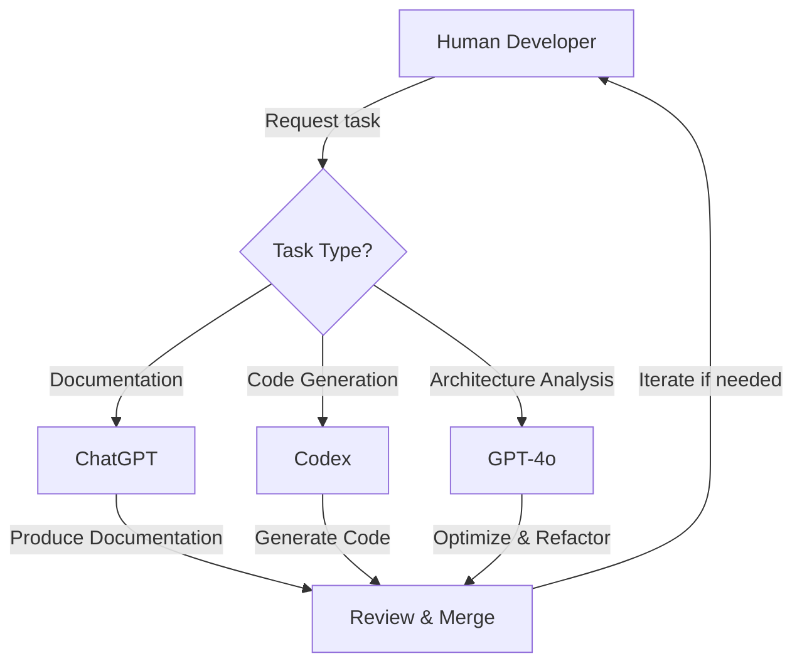

## 📝 Quick Reference Card

```
🔑 Key Information:
- Kotlin/Java project with CQRS architecture
- Use ChatGPT for documentation, Codex for code generation, GPT-4o for complex analysis
- Follow coding guidelines in Spine Event Engine docs
- Always include tests with code changes
- Version bump required for all PRs
```

## Table of Contents
1. [Purpose](#-purpose)
2. [Project overview](#-project-overview)
3. [Agent responsibilities](#-agent-responsibilities)
   - [Agent collaboration workflow](#agent-collaboration-workflow)
   - [Tagging pull request messages](#tagging-pull-request-messages)
   - [Selecting the right Agent](#selecting-the-right-agent)
4. [Coding guidelines for Agents](#-coding-guidelines-for-agents)
5. [Running builds](#running-builds)
6. [Version policy](#version-policy)
7. [Project structure expectations](#-project-structure-expectations)
8. [Documentation tasks](#-documentation-tasks)
9. [Testing](#-testing)
10. [Safety rules for Agents](#-safety-rules-for-agents)
11. [Refactoring guidelines](#-refactoring-guidelines)
12. [Interaction tips – key to effective collaboration!](#-interaction-tips--key-to-effective-collaboration)
13. [LLM goals](#-llm-goals)
    - [Problem-solving framework](#problem-solving-framework-for-complex-tasks)
    - [GPT-4o advanced capabilities](#-gpt-4o-advanced-capabilities)
14. [Common tasks](#-common-tasks)
15. [Welcome, Agents!](#-welcome-agents)

## 🧠 Purpose

> **EXECUTIVE SUMMARY**: This guide outlines how AI agents (ChatGPT, Codex, GPT-4o)
> collaborate on our Kotlin/Java project. It defines responsibilities, coding standards,
> and workflows to maintain high code quality and architectural integrity.

This document explains how to use **ChatGPT** and **Codex** effectively in this Kotlin/Java project.

It outlines:

- Agent responsibilities (who does what).
- Coding and architectural guidelines agents must follow.
- Instructions for creating and testing agent-generated outputs.

Whether you are a developer, tester, or contributor, this guide will help you collaborate
with AI to maintain a high-quality codebase.

### Terminology
- **LLM**: Refers to the general category of language models (e.g., ChatGPT, Codex, Claude, Junie).
- **Agents**: A broader term for LLMs collaborating on this project. 
- Use specific names (**ChatGPT**, **Codex**) when they excel at different tasks 
  (e.g., scaffolding versus explanation).

---

## 🛠️ Project overview

- **Languages**: Kotlin (primary), Java (secondary).
- **Build tool**: Gradle with Kotlin DSL.
- **Architecture**: Event-driven Command Query Responsibility Segregation (CQRS).
- **Static analysis**: detekt, ErrorProne, Checkstyle, PMD. 
- **Testing**: JUnit 5, Kotest Assertions, Codecov.
- **Tools used**: Gradle plugins, IntelliJ IDEA Platform, KSP, KotlinPoet, Dokka. 

---

## 🤖 Agent responsibilities

| Task/Feature                      | Primary Agent | Supporting Agent | Notes                                       |
|-----------------------------------|---------------|------------------|---------------------------------------------|
| Writing documentation (like KDoc) | ChatGPT       | Codex            | Use for readable, structured docs.          |
| Explaining APIs and architecture  | ChatGPT       | -                | Great for clarity in team workflows.        |
| Code generation (e.g., tests)     | Codex         | ChatGPT          | Codex produces quick scaffolding.           |
| Code refactoring suggestions      | ChatGPT       | Codex            | Use ChatGPT for design-level improvements.  |
| Completing functions or classes   | Codex         | -                | Codex is better for direct completions.     |
| Debugging and test suggestions    | ChatGPT       | Codex            | ChatGPT suggests missing scenarios.         |
| Advanced architecture analysis    | GPT-4o        | -                | Best for complex CQRS pattern optimization. |
| Kotlin idiom optimization         | GPT-4o        | Codex            | Leverages latest language features.         |

### Agent collaboration workflow



*Note: The diagram shows the typical workflow and which agent to use for different task types.*


### Tagging pull request messages

Use PR tags for clarity:
```text
feat(chatgpt): Updated README with clearer KDoc examples
fix(codex): Completed missing `when` branches in tests
perf(gpt-4o): Optimized event processing pipeline
```
#### Why tag pull requests?
Tagging PRs helps the team:
  - Track which agent contributed to specific changes.
  - Understand whether a PR needs extra human review based on the agent's role.
  - Make decisions about multi-agent collaboration in reviews.

### Selecting the right Agent

<details>
<summary>Click to expand the decision tree for agent selection</summary>

```
Is the task primarily documentation or explanation?
├── Yes → Use ChatGPT
└── No → Continue

Is the task primarily generating boilerplate code or tests?
├── Yes → Use Codex
└── No → Continue

Does the task involve complex architectural decisions or advanced Kotlin features?
├── Yes → Use GPT-4o
└── No → Use ChatGPT for analysis, then Codex for implementation
```

**Task examples by Agent:**

- **ChatGPT**: Documentation, conceptual explanations, architectural insights
- **Codex**: Code generation, test scaffolding, completing partially written code
- **GPT-4o**: Advanced architectural patterns, Kotlin idiom optimization, complex refactoring

</details>

---

## 🧾 Coding guidelines for Agents

### Core principles

- Adhere to [Spine Event Engine Documentation][spine-docs] for coding style.
- Generate code that compiles cleanly and passes static analysis.
- Respect existing architecture, naming conventions, and project structure.
- Write clear, incremental commits with descriptive messages.
- Include automated tests for any code change that alters functionality.

### Kotlin best practices

#### ✅ Prefer
- **Kotlin idioms** over Java-style approaches:
  - Extension functions
  - `when` expressions 
  - Smart casts
  - Data classes and sealed classes
  - Immutable data structures
- **Simple nouns** over composite nouns (`user` > `userAccount`)  
- **Generic parameters** over explicit variable types (`val list = mutableList<Dependency>()`)  
- **Java interop annotations** only when needed (`@file:JvmName`, `@JvmStatic`)
- **Kotlin DSL** for Gradle files

#### ❌ Avoid
- Mutable data structures
- Java-style verbosity (builders with setters)
- Redundant null checks (`?.let` misuse)
- Using `!!` unless clearly justified
- Type names in variable names (`userObject`, `itemList`)
- String duplication (use constants in companion objects)
- Mixing Groovy and Kotlin DSLs in build logic
- Reflection unless specifically requested

### Documentation & comments

#### KDoc style
- Write concise descriptions for all public and internal APIs.
- Start parameter descriptions with capital letters.
- End parameter descriptions with commas.
- Use inline code with backticks for code references (`example`).
- Format code blocks with fences and language identifiers:
  ```kotlin
  // Example code
  fun example() {
      // Implementation
  }
  ```

#### Commenting guidelines
- Avoid inline comments in production code unless necessary.
- Inline comments are helpful in tests.
- When using TODO comments, follow the format on [dedicated page][todo-comments].
- File and directory names should be formatted as code.

#### Tex width
- Wrap `.md` text to 80 characters for readability.
- Wrap KDoc comments at 75 characters. 

#### Using periods
- Use periods at the end of complete sentences.
- Use no periods for short bullets.
- Use periods for full or multi-clause bullets.
- Use no periods for fragments.
- Be consistent within the list!

### Text formatting
 - ✅ Remove double empty lines in the code.
 - ✅ Remove trailing space characters in the code.

---

## Safety rules

- ✅ All code must compile and pass static analysis.
- ✅ Do not auto-update external dependencies.
- ❌ Never use reflection or unsafe code without explicit approval.
- ❌ No analytics or telemetry code.
- ❌ No blocking calls inside coroutines.

---

## Version policy

<details>
<summary>Click to expand versioning guidelines</summary>

### We use semver
The version of the project is kept in the `version.gradle.kts` file in the root of the project.

The version numbers in these files follow the conventions of
[Semantic Versioning 2.0.0](https://semver.org/).

### Quick checklist for versioning
1. Increment the patch version in `version.gradle.kts`.
   Retain zero-padding if applicable:
    - Example: `"2.0.0-SNAPSHOT.009"` → `"2.0.0-SNAPSHOT.010"`
2. Commit the version bump separately with this comment:
   ```text
   Bump version → `$newVersion`
   ``` 
3. Rebuild using `./gradlew clean build`.
4. Update `pom.xml`, `dependencies.md` and commit changes with: `Update dependency reports`

Remember: PRs without version bumps will fail CI (conflict resolution detailed above).

### Resolving conflicts in `version.gradle.kts`
A branch conflict over the version number should be resolved as described below.
 * If a merged branch has a number which is less than that of the current branch, the version of
   the current branch stays.
 * If the merged branch has the number which is greater or equal to that of the current branch,
   the number should be increased by one.

### When to bump the version?
 - When a new branch is created.
 
</details>
---

## Running builds

<details>
<summary>Click to expand build instructions</summary>

1. When modifying code, run:
   ```bash
   ./gradlew build
   ```

2. If Protobuf (`.proto`) files are modified run:
   ```bash
   ./gradlew clean build
   ````

3. Documentation-only changes run:
   ```bash
   ./gradlew dokka
   ```
   Documentation-only changes do not require running tests!

</details>
---

## 📁 Project structure expectations

<details>
<summary>Click to expand project structure details</summary>

```yaml
.github
buildSrc/
<module-1>
  src/
  ├── main/
  │ ├── kotlin/ # Kotlin source files
  │ └── java/ # Legacy Java code
  ├── test/
  │ └── kotlin/ # Unit and integration tests
  build.gradle.kts # Kotlin-based build configuration
<module-2>
<module-3>
build.gradle.kts # Kotlin-based build configuration
settings.gradle.kts # Project structure and settings
README.md # Project overview
AGENTS.md # LLM agent instructions (this file)
version.gradle.kts # Declares the project version. 
```

</details>
---

## 📄 Documentation tasks

<details>
<summary>Click to expand documentation guidelines</summary>

- Suggest better **names** and **abstractions**.

#### Documentation checklist
1. Ensure all public and internal APIs have KDoc examples.
2. Add in-line code blocks for clarity.
3. Use `TODO` comments with agent names for unresolved logic sections:
    - Example: `// TODO(chatgpt): Refactor `EventStore` for better CQRS compliance.`

</details>

---

## 🧪 Testing

### Guidelines
- Do not use mocks, use stubs.
- Prefer [Kotest assertions][kotest-assertions] over
  assertions from JUnit or Google Truth.

### Responsibilities

#### Codex
- Generate unit tests for APIs (handles edge cases/scenarios).
- Supply scaffolds for typical Kotlin patterns (`when`, sealed classes).

#### ChatGPT
- Suggest test coverage improvements.
- Propose property-based testing or rare edge case scenarios.

---

## 🚨 Safety rules for Agents

- Do **not** auto-update external dependencies without explicit request.
- Do **not** inject analytics or telemetry code.
- Flag any usage of unsafe constructs (e.g., reflection, I/O on the main thread).
- Avoid generating blocking calls inside coroutines.

---

## ⚙️ Refactoring guidelines

<details>
<summary>Click to expand refactoring guidelines</summary>

- Do not replace Kotest assertions with standard Kotlin's Built-In Test Assertions.

</details>

---

## 💬 Interaction tips – key to effective collaboration!

<details>
<summary>Click to expand collaboration guidelines</summary>

- Human programmers may use inline comments to guide agents:
  ```kotlin
    // ChatGPT: Suggest a refactor for better readability.
    // Codex: Complete the missing branches in this `when` block.
    // ChatGPT: explain this logic.
    // Codex: complete this function.
   ```
- Agents should ensure pull request messages are concise and descriptive:
  ```text
  feat(chatgpt): suggested DSL refactoring for query handlers  
  fix(codex): completed missing case in sealed class hierarchy
  ```
- Encourage `// TODO:` or `// FIXME:` comments to be clarified by ChatGPT.

- When agents or humans add TODO comments, they **must** follow the format described on
  the [dedicated page][todo-comments].

</details>

---

## 🧭 LLM goals

These goals guide how agents (ChatGPT, Codex) are used in this project to:
- Help developers move faster without sacrificing code quality.
- Provide language-aware guidance on Kotlin/Java idioms.
- Lower the barrier to onboarding new contributors.
- Enable collaborative, explainable, and auditable development with AI.

### Problem-solving framework for complex tasks

When faced with complex tasks, follow this framework:

1. **Decompose**: Break down the problem into smaller, manageable parts
2. **Analyze**: Understand the architectural implications of each part
3. **Pattern-Match**: Identify established patterns that apply
4. **Implement**: Write code that follows project conventions
5. **Test**: Ensure comprehensive test coverage
6. **Document**: Provide clear explanations of your solution

*This framework helps maintain consistency across contributions from different agents.*

### 🚀 GPT-4o advanced capabilities

GPT-4o excels at these high-value tasks in our CQRS architecture:

1. **Architecture-level insights**
   - Suggesting architectural improvements in CQRS pattern implementation
   - Identifying cross-cutting concerns between command and query sides
   - Optimizing event flow and state propagation

2. **Advanced Kotlin refactoring**
   - Converting imperative code to idiomatic Kotlin (sequences, extensions, etc.)
   - Applying context receivers and other Kotlin 1.6+ features
   - Optimizing coroutine patterns and structured concurrency

3. **Testing intelligence**
   - Identifying missing property-based test scenarios
   - Suggesting event sequence combinations that could cause race conditions
   - Creating comprehensive test fixtures for complex domain objects

#### Example prompts for GPT-4o

Leverage GPT-4o's advanced capabilities with prompts like these:

```text
# Architecture analysis
"Analyze this CommandHandler implementation and suggest improvements to better align with CQRS principles, especially considering event sourcing implications."

# Kotlin refactoring
"Refactor this Java-style code to use more idiomatic Kotlin patterns. Pay special attention to immutability, extension functions, and DSL opportunities."

# Test enhancement
"Review this test suite for our event processing pipeline and suggest additional test scenarios focusing on concurrent event handling edge cases."
```

---

## 📋 Common tasks

<details>
<summary>Click to expand common task instructions</summary>

- **Adding a new dependency**: Update relevant files in `buildSrc` directory.
- **Creating a new module**: Follow existing module structure patterns.
- **Documentation**: Use KDoc style for public and internal APIs.
- **Testing**: Create comprehensive tests using Kotest assertions.

</details>

--- 

## 👋 Welcome, Agents!
 - You are here to help.
 - Stay consistent, stay clear, and help this Kotlin/Java codebase become more robust,
   elegant, and maintainable.

[//]: # (External links)
[spine-docs]: https://github.com/SpineEventEngine/documentation/wiki
[kotest-assertions]: https://kotest.io/docs/assertions/assertions.html
[todo-comments]: https://github.com/SpineEventEngine/documentation/wiki/TODO-comments
